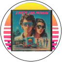

[[🏠︎](https://github.com/APrettyCoolProgram)]

  <picture>
    <source media="(prefers-color-scheme: dark)" srcset="../img/logo/apcp-logo-dark-128x128.png">
    <source media="(prefers-color-scheme: light)" srcset="../img/logo/apcp-logo-light-128x128.png">
    
  </picture>

# Guidelines

* Development
* Documentation
  * [XML Documentation](./documentation/xml-documentation-for-csharp.md)
  * [Mermaid.js](./documentation/mermaid-js.md)
* Project
* Repository
* Source code

[[🏠︎](https://github.com/APrettyCoolProgram)]
